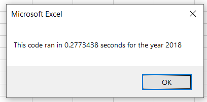

# VBA Stock Analysis
## Overview
This project was designed to offer decision support for potential investors in green energy companies by analyzing the performance of 12 such stocks over a particular year. Since the dataset included sheets for two years and the amount of information contained in each was extensive, VBA was used to prompt the user to input a year, then calculate volume and return for all included stocks within that year. The script also included conditional formatting to help differentiate positive from negatively performing stocks. The code was also refactored in order to analyze the efficiency of two different methods--the first, using a for loop to cycle through the 12 different tickers; the second, using an index variable and storing the values in a series of arrays before outputting them to the spreadsheet.

## Results
### Yearly Stock Performance
Analyzing the performance of all stocks together, rather than any single stock on its own, makes shared trends very clear: for most of these stocks, 2017 was a good year, and 2018 was a bad one. 

 

A drawback of the code as currently written is that it does not allow side-by-side analysis of the two years within the spreadsheet. However, viewing the two screenshots here, we can see that only two stocks had positive returns for both of the years under analysis. Based on the information presented here, there are three top candidates.
1. ENPH is the clear frontrunner, with exceptional performance in 2017 and good returns in 2018. 
2. RUN is also a strong contender. While it had only a 5% return in 2017, it fared comparably to ENPH in 2018.
3. SEDG is worth watching. While its returns in 2018 were negative, they were only slightly so, and it did even better than ENPH in 2017.

### Execution Times
As mentioned in the overview, two different methods of analysis were compared:
1. Creating an array of tickers, then using a for loop to cycle through them and outputting the results to a spreadsheet before moving to the next ticker
```
    For i = 0 To 11

        ticker = tickers(i)
        totalVolume = 0

    'Loop through rows in the data.
        Worksheets("2018").Activate
        For j = 2 To RowCount

            'Find the total volume for the current ticker.
            If Cells(j, 1).Value = ticker Then
                totalVolume = totalVolume + Cells(j, 8).Value

            End If

'            'Find the starting price for the current ticker.
            If Cells(j, 1).Value = ticker And Cells(j - 1, 1).Value <> ticker Then

                startingPrice = Cells(j, 6).Value
'
            End If
'            'Find the ending price for the current ticker.
            If Cells(j, 1).Value = ticker And Cells(j + 1, 1).Value <> ticker Then

                endingPrice = Cells(j, 6).Value

            End If
        Next j
'    'Output the data for the current ticker.
    Worksheets("All Stocks Analysis").Activate
    Cells(4 + i, 1).Value = ticker
    Cells(4 + i, 2).Value = totalVolume
    Cells(4 + i, 3).Value = endingPrice / startingPrice - 1

    Next i
```
2. Creating an index variable to be used when looping through the array of tickers, then storing the results of each loop in an array before outputting all results to the worksheet.
```
'1a) Create a ticker Index
    tickerIndex = 0

    '1b) Create three output arrays
    Dim tickerVolumes(11) As Long
    
    Dim tickerStartingPrices(11) As Single
    
    Dim tickerEndingPrices(11) As Single
    
    
        '2a) Create a for loop to initialize the tickerVolumes to zero.
    For j = 0 To 11
        tickerVolumes(j) = 0
    
    Next j
        
    '2b) Loop over all the rows in the spreadsheet.
    For i = 2 To RowCount
    
        '3a) Increase volume for current ticker
        'Find the total volume for the current ticker.

        tickerVolumes(tickerIndex) = tickerVolumes(tickerIndex) + Cells(i, 8).Value
                  
        '3b) Check if the current row is the first row with the selected tickerIndex.
        If Cells(i, 1).Value = tickers(tickerIndex) And Cells(i - 1, 1).Value <> tickers(tickerIndex) Then
            tickerStartingPrices(tickerIndex) = Cells(i, 6).Value
            
        End If
        
        '3c) check if the current row is the last row with the selected ticker
         'If the next row’s ticker doesn’t match, increase the tickerIndex.
        If Cells(i, 1).Value = tickers(tickerIndex) And Cells(i + 1, 1).Value <> tickers(tickerIndex) Then
            tickerEndingPrices(tickerIndex) = Cells(i, 6).Value
        
            '3d Increase the tickerIndex.
            tickerIndex = tickerIndex + 1
            
        End If
        
    Next i
    
    '4) Loop through your arrays to output the Ticker, Total Daily Volume, and Return.
    For i = 0 To 11
        
        Worksheets("All Stocks Analysis").Activate
        
        Cells(i + 4, 1).Value = tickers(i)
        Cells(i + 4, 2).Value = tickerVolumes(i)
        Cells(i + 4, 3).Value = tickerEndingPrices(i) / tickerStartingPrices(i) - 1
        
    Next i
```
Method #2 was faster by a statistically but not practically significant amount: method 1 took .92 seconds for 2017 and .98 for 2018, while method 2 took .42 seconds for 2017 and.28 seconds for 2018. In a program that takes minutes or hours to run, a 50-70% time savings is a huge improvement; however, since both versions took less than a second to run over this particular dataset, the refactoring did not result in any real time savings.

Method 1 Performance

 

Method 2 Performance

 

## Summary
### Refactoring Code
In general, refactoring code can be extremely useful. It may be useful or even necessary to improve the performance of slow-running code, and it can be used to clean up duplicative code or simplify unnecessarily complex logic. As with any form of writing, it is very likely that the code writer's understanding of the task at hand and how best to accomplish it will have changed by the end of their first pass through the task in its entirety, and refactoring provides an opportunity to apply those new insights and make the finished product easier for others to read.

However, refactoring is also subject to the possibility of diminishing returns. As noted in the results, an (averaged) 60% performance gain on code that takes a lot of time or resources to run will have a large impact, but 60% of a second is a time difference that is barely noticeable to humans. Since refactoring can take quite a lot of time to do, the potential for gain in performance, readabilty, and reusability must be weighed against the amount of time needed to achieve it. 

### Refactoring _this_ Code
For this particular analysis, the primary gain from refactoring was of knowledge rather than performance: I learned how to store the results of a for loop in an array, then loop through the arrays again to output the results onto the spreadsheet. Outside of this increase in knowledge, there wasn't much benefit in refactoring to use the second method: the two take comparable amounts of time and do not differ widely in how easy they are to read and understand.

Moreover, the order of events in this assignment--write, refactor, anayze--meant that the refactoring did not have the benefit of any additional insights gained during the initial phases of analysis. Refactoring slightly improved the performance of the code, but it took me a long time to figure out, and since the code ran so quickly in the first place, the time was not spent addressing a real deficit. It would have been better spent in changing the output of the macro to apply what I realized in beginning this analysis: 1) that the ability to view side-by-side results from the two years analyzed would offer much better decision support than toggling between the two, and 2) that additional granularity in the color coding would help to further differentiate between stocks that barely broke even and those that really excelled in a given year, or between those with minimal and major losses. Updating the code to implement these two changes would result a greater improvement to an end user than a gain of .5 seconds per run.
